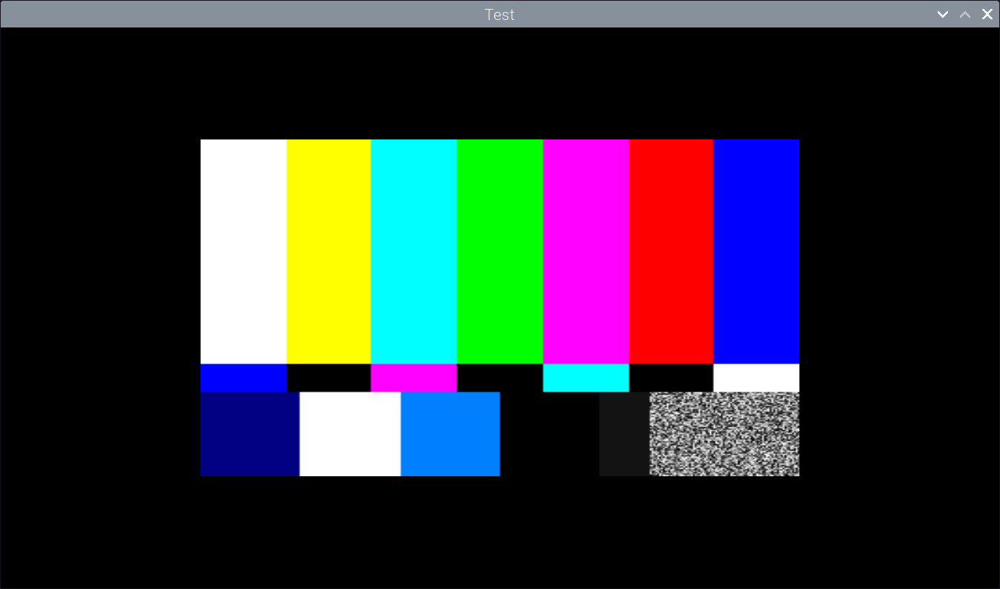

# SDL Testbed Applications for Raspberry Pi

## Raspbian

Reference version:

```
PRETTY_NAME="Raspbian GNU/Linux 11 (bullseye)"
NAME="Raspbian GNU/Linux"
VERSION_ID="11"
VERSION="11 (bullseye)"
VERSION_CODENAME=bullseye
ID=raspbian
ID_LIKE=debian
HOME_URL="http://www.raspbian.org/"
SUPPORT_URL="http://www.raspbian.org/RaspbianForums"
BUG_REPORT_URL="http://www.raspbian.org/RaspbianBugs"
```

Reference SDL is [`roman380/SDL`](https://github.com/roman380/SDL.git) fork at branch `rpi`.

### Branch [`raspbian/videodriver`](https://github.com/roman380/sdlsandbox/tree/raspbian/videodriver)

See [SDL2 on Raspberry Pi without X?](https://stackoverflow.com/a/57684805/868014)

### Branch [`raspbian/gstreamer`](https://github.com/roman380/sdlsandbox/tree/raspbian/gstreamer)

Integrates GStreamer video rendering into OpenGL (GLX) rendering pipeline.




